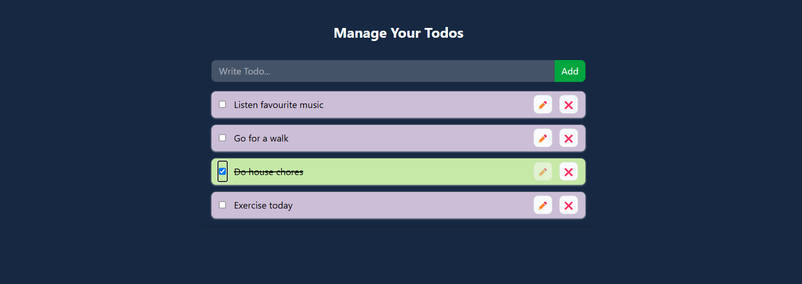

# To-Do List Project
- Overview
This project is a simple To-Do List application built using React and Vite. It allows users to manage their tasks efficiently with a clean and responsive interface.

# Features
1. Add, edit, and delete tasks
2. Persistent storage using localStorage
3. Responsive design

# Technologies Used
1. React: A JavaScript library for building user interfaces.
2. Vite: A fast build tool and development server.
3. Tailwind CSS: A utility-first CSS framework for styling.
4. ESLint: A tool for identifying and fixing problems in JavaScript code.

# View here:
 https://nandinee-sharma.github.io/ToDoList/

# Preview:

# Usage
The application allows you to add tasks to your list.
Tasks can be marked as completed or deleted.
Data is stored in localStorage(not applicable here), ensuring persistence across sessions.

# Contributing
Contributions are welcome! Please open an issue or submit a pull request for any enhancements or bug fixes.# localStorage: 
- It is an object, which allows you to store key-value pairs in the browser
- The data is not deleted when the browser is closed, and are
available for future sessions.
- values are stored in string by default, needs to be converted from/to json
- it has two methods: *setItem() and *getItem()
